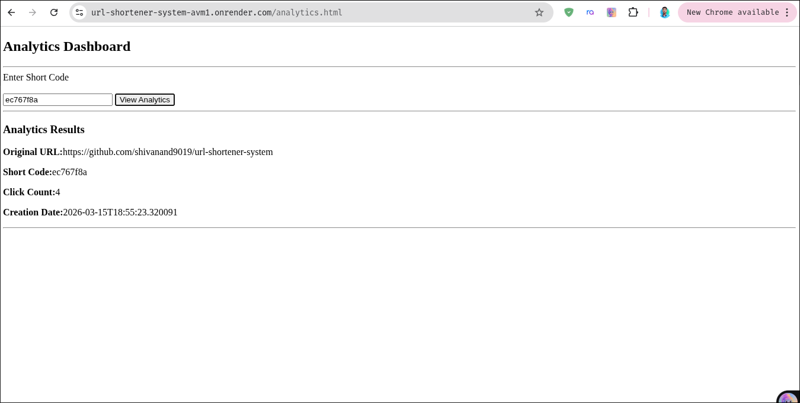

# URL Shortener System

A simple URL Shortener built using **Spring Boot** and PostgreSQL.

This project allows users to generate short URLs, redirect to the original website, and view click analytics using a simple dashboard.

The purpose of this project was to understand how systems like Bitly work and to practice backend API development.

---

## Live Demo

Deployed Application:

https://url-shortener-system-avm1.onrender.com

Example:

https://your-app-link.com

---

## Features

✔ Generate short URLs from long links  
✔ Redirect users using short codes   
✔ Track click counts for each link  
✔ Analytics API to view statistics  
✔ Simple analytics dashboard  
✔ Cloud deployment

---

## Screenshots

Homepage

Add your homepage screenshot here.

screenshots/homepage.png

Example:

"Homepage" (screenshots/homepage.png)


---

Analytics Dashboard



screenshots/analytics.png

Example:

"Analytics Dashboard" (screenshots/analytics.png)

---

### Tech Stack

**Backend**

- Java
- Spring Boot

**Database**

- PostgreSQL

**Frontend**

- HTML
- JavaScript

**Deployment**

- Render

---

## API Endpoints

**1. Create Short URL**
```
POST /api/shorten

Example request

{
"url": "https://example.com"
}
```
---

**2️. Redirect to Original URL**

```
GET /s/{shortCode}

Example

/s/abc123
```
---

**3️. Get Analytics**

```
GET /analytics/{shortCode}

Example response

{
"originalUrl": "https://example.com",
"shortCode": "abc123",
"clickCount": 5,
"createdAt": "2026-03-16"
}
```
---

## Project Structure
```
src
└─ main
│   ├─ java
│   ├─ controller
│   ├─ service
│   ├─ repository
│   ├─ dto
│   └─ model
│   
│
│─ screenshots
└─ resources
    └─ static
        ├─ index.html
        ├─ analytics.html
        └─ script.js
```
---

## Future Improvements

Possible improvements for this project:

• Custom short URLs   
• URL expiration  
• Redis caching for faster redirects  
• Rate limiting  
• Improved analytics dashboard

---

 ## What I Learned

While building this project I learned about:

• Designing REST APIs using Spring Boot  
• Working with PostgreSQL and JPA  
• Handling HTTP redirects in web applications  
• Building simple frontend dashboards using JavaScript  
• Deploying backend applications to the cloud  
• Structuring backend projects properly

---

## Author

Built as part of my backend development learning journey.